# 🚀 Guía de Configuración: Sistema de Vectorización con TypeORM

## 📋 Pasos para Implementar

### 1. Levantar PostgreSQL con pgvector

```bash
# Levantar el nuevo contenedor (puerto 5433 para no conflictar)
docker-compose -f docker-compose.vectordb.yml up -d

# Verificar que está funcionando
docker logs olaspp_postgres_vector

# Deberías ver: "database system is ready to accept connections"
```

### 2. Configurar Variables de Entorno

Actualiza tu archivo `.env`:

```env
# Base de datos (NUEVO puerto y credenciales)
DB_HOST=localhost
DB_PORT=5433
DB_USERNAME=postgres
DB_PASSWORD=olaspp_password
DB_DATABASE=olaspp

# Configuración de Embeddings
USE_LOCAL_EMBEDDINGS=true
EMBEDDING_DIMENSIONS=384

# Si quieres usar Hugging Face (opcional)
# HUGGINGFACE_API_KEY=tu_api_key_aqui
```

### 3. Ejecutar Migraciones

```bash
# Ir al directorio backend
cd backend

# Instalar dependencias (si no lo has hecho)
npm install

# Ejecutar migraciones de TypeORM
npm run migration:run
```

**Deberías ver:**
```
🔄 Initializing database connection...
✅ Database connection established successfully
📦 Extensions (PostGIS, pgvector) verified
🔄 Running pending migrations...
✅ 1 migration(s) executed successfully:
   - AddVectorization1730000000000
✅ Database connection closed
```

### 4. Verificar la Instalación

```bash
# Conectarse a la base de datos
docker exec -it olaspp_postgres_vector psql -U postgres -d olaspp

# Dentro de psql, verificar las extensiones
\dx

# Deberías ver:
#  postgis  | 3.4.0
#  vector   | 0.7.4

# Ver las nuevas tablas
\dt

# Deberías ver:
#  report_embeddings
#  report_feedback
#  reports
#  spots
#  users

# Salir
\q
```

### 5. Instalar Ollama para Embeddings Locales (Recomendado)

```bash
# Instalar Ollama
curl -fsSL https://ollama.com/install.sh | sh

# Descargar modelo de embeddings
ollama pull nomic-embed-text

# Verificar que funciona
ollama list
```

### 6. Probar el Sistema

```bash
# Iniciar tu servidor backend
npm run dev

# Deberías ver:
# 🔢 Embedding Service initialized with model: sentence-transformers/all-MiniLM-L6-v2
```

## 🧪 Testing

### Generar un Reporte de Prueba

```bash
curl -X POST http://localhost:3000/api/reports/generate \
  -H "Content-Type: application/json" \
  -d '{
    "spotId": "tu-spot-id-aqui",
    "forecastDays": 7
  }'
```

### Enviar Feedback

```bash
curl -X POST http://localhost:3000/api/reports/{reportId}/feedback \
  -H "Content-Type: application/json" \
  -d '{
    "rating": 5,
    "comment": "¡Excelente predicción!",
    "weather_accuracy_rating": 5,
    "recommendation_helpfulness": 5
  }'
```

### Ver Reportes Similares

```bash
curl http://localhost:3000/api/reports/{reportId}/similar?limit=5
```

## 📊 Estructura de la Base de Datos

### Tablas Creadas

1. **report_feedback** - Almacena ratings y comentarios de usuarios
2. **report_embeddings** - Vectores de condiciones meteorológicas (384 dimensiones)

### Funciones SQL Disponibles

- `find_similar_reports()` - Busca reportes con condiciones similares
- `update_embedding_rating()` - Actualiza ratings automáticamente

### Trigger Automático

Cuando un usuario envía feedback, el trigger actualiza automáticamente:
- `avg_rating` en `report_embeddings`
- `total_feedback_count` en `report_embeddings`

## 🔄 Flujo de Trabajo

```mermaid
graph TD
    A[Usuario solicita reporte] --> B[Sistema extrae condiciones]
    B --> C[Genera embedding 384D]
    C --> D[Busca reportes similares con buen feedback]
    D --> E{¿Encontró similares?}
    E -->|Sí| F[IA usa como contexto]
    E -->|No| G[IA genera desde cero]
    F --> H[Genera reporte mejorado]
    G --> H
    H --> I[Guarda reporte + embedding]
    I --> J[Usuario recibe reporte]
    J --> K[Usuario da feedback]
    K --> L[Trigger actualiza rating en embedding]
    L --> D
```



## 🛠️ Comandos Útiles

### Migraciones

```bash
# Ver migraciones pendientes
npm run migration:show

# Ejecutar migraciones
npm run migration:run

# Revertir última migración
npm run migration:revert

# Crear nueva migración
npm run migration:create -- src/database/migrations/NombreMigracion
```

### Base de Datos

```bash
# Ver logs del contenedor
docker logs -f olaspp_postgres_vector

# Hacer backup
docker exec olaspp_postgres_vector pg_dump -U postgres olaspp > backup.sql

# Restaurar backup
docker exec -i olaspp_postgres_vector psql -U postgres olaspp < backup.sql

# Entrar al contenedor
docker exec -it olaspp_postgres_vector bash
```

## ⚠️ Troubleshooting

### Error: "extension vector does not exist"

```bash
# Entrar al contenedor
docker exec -it olaspp_postgres_vector psql -U postgres -d olaspp

# Crear la extensión manualmente
CREATE EXTENSION IF NOT EXISTS vector;
```

### Error: "relation report_embeddings does not exist"

```bash
# Verificar que las migraciones se ejecutaron
npm run migration:show

# Si no aparece AddVectorization, ejecutar:
npm run migration:run
```

### Error: "port 5433 already in use"

```bash
# Ver qué proceso usa el puerto
sudo lsof -i :5433

# Cambiar el puerto en docker-compose.vectordb.yml:
# ports:
#   - "5434:5432"  # Usa 5434 en lugar de 5433
```

### Embeddings muy lentos

1. Verifica que Ollama esté corriendo: `ollama list`
2. Asegúrate de tener `USE_LOCAL_EMBEDDINGS=true` en `.env`
3. Si sigue lento, el sistema usará embeddings simples automáticamente

### No encuentra reportes similares

```sql
-- Conectarse a la DB
docker exec -it olaspp_postgres_vector psql -U postgres -d olaspp

-- Ver cuántos reportes tienen feedback
SELECT COUNT(*) FROM report_feedback;

-- Ver cuántos embeddings hay
SELECT COUNT(*) FROM report_embeddings;

-- Si hay pocos, genera más reportes y agrega feedback de prueba
```

## 🔐 Migrar desde tu BD Actual

Si ya tienes datos en tu instancia actual y quieres migrarlos:

```bash
# 1. Hacer dump de tu BD actual (puerto 5432)
docker exec xcars_postgres pg_dump -U postgres tu_base_de_datos > datos_actuales.sql

# 2. Restaurar en la nueva BD (puerto 5433)
docker exec -i olaspp_postgres_vector psql -U postgres olaspp < datos_actuales.sql

# 3. Ejecutar las migraciones de vectorización
npm run migration:run
```

## 📈 Monitoreo

### Ver estadísticas

```bash
curl http://localhost:3000/api/reports/embeddings/stats
```

Respuesta ejemplo:
```json
{
  "success": true,
  "data": {
    "total": 150,
    "withFeedback": 87,
    "averageRating": 4.2,
    "spotsWithEmbeddings": 15
  }
}
```

### Ver reportes mejor valorados

```bash
curl http://localhost:3000/api/reports/top-rated?limit=10
```

## ✅ Checklist de Instalación

- [ ] Docker Compose levantado en puerto 5433
- [ ] Variables de entorno configuradas en `.env`
- [ ] Migraciones ejecutadas correctamente
- [ ] Extensiones `postgis` y `vector` instaladas
- [ ] Ollama instalado y modelo descargado (opcional)
- [ ] Servidor backend corriendo
- [ ] Primer reporte generado exitosamente
- [ ] Feedback enviado y procesado

## 🎉 ¡Listo!

El sistema de vectorización está configurado y funcionando. Ahora:

1. Genera algunos reportes
2. Pide a usuarios (o tú mismo) que den feedback
3. Los nuevos reportes usarán automáticamente los anteriores como referencia
4. El sistema mejorará continuamente con cada feedback

¿Necesitas ayuda? Revisa los logs:
```bash
# Logs del backend
npm run dev

# Logs de PostgreSQL
docker logs -f olaspp_postgres_vector
```
